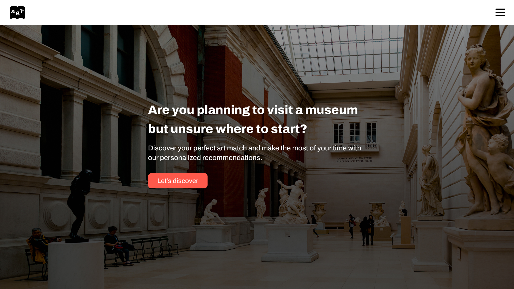

# ArtBook

✸ Explore the MET's collection with ease, one artwork at a time!  

We developed a website that recommends artworks tailored to users' preferences by integrating the MET API. I utilized React to manage and integrate the entire HTML/CSS structure seamlessly.  
Collaborating closely with my colleague, a UI/UX designer, provided me with valuable experience in teamwork and cross-functional collaboration!

## Features
- Fetch data from the MET API
- Display similar artworks based on four different categories
- Show detailed information about each artwork through search endpoints
- Add a feature to let users favorite artworks (MongoDB)
- Show other users' favorite artworks depends on user's emoji choice
- Show the analytics of user's fav artworks' departments 

## Built with
- React
- MET API
- MongoDB
- Chart.js
